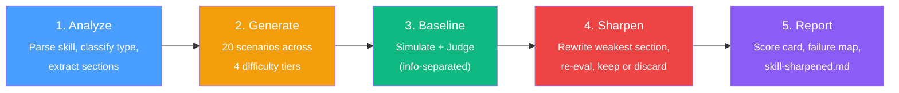
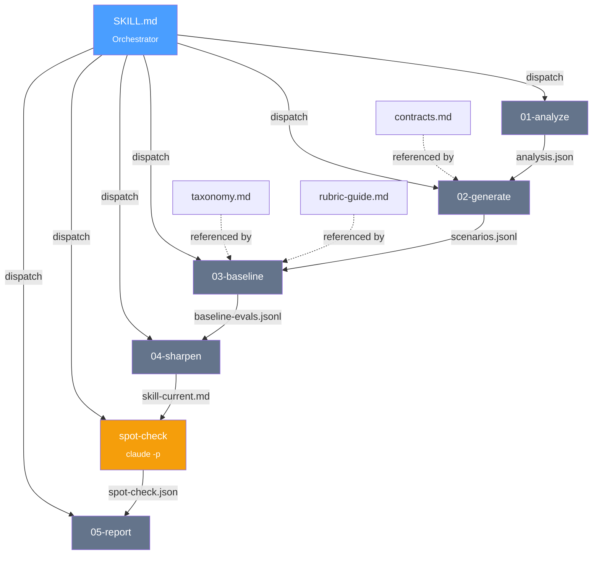

# Skill Battlefield

> Stress-test your AI agent skills. Get evidence, not opinions.

[](LICENSE)
[](https://code.claude.com)
[]()

A Claude Code plugin that generates test scenarios, evaluates skills via simulated execution, proposes targeted improvements, and produces evidence reports. **AI tests, humans write** — the skill author makes the final call.


## How It Works



The simulator never sees the rubric. The judge never sees the skill text. This information separation prevents contaminated scores.


## Quick Start

```bash
# Install the plugin
claude plugins add /path/to/skill-battlefield

# Battle-test a skill
/battle ~/.claude/skills/my-skill/SKILL.md

# With options
/battle ~/.claude/skills/my-skill/SKILL.md --scenarios 20 --iterations 5
```

Results appear in `~/.skill-battlefield/runs/<skill-name>/<timestamp>/`.


## Sample Report

What you get after a battle run:

```
# Battle Report: daily-task

Score Card
┌─────────────────────────────┬────────┬───────┬───────┐
│ Dimension                   │ Before │ After │ Delta │
├─────────────────────────────┼────────┼───────┼───────┤
│ D1: Activation Reliability  │   7.0  │  7.0  │   —   │
│ D2: Execution Compliance    │   5.5  │  8.0  │ +2.5  │
│ D3: Behavioral Alignment    │   6.0  │  7.5  │ +1.5  │
│ D4: Instruction Clarity     │   7.0  │  8.5  │ +1.5  │
│ D5: Architecture            │   8.0  │  8.0  │   —   │
│ D6: Evolvability            │   4.0  │  5.5  │ +1.5  │
├─────────────────────────────┼────────┼───────┼───────┤
│ Overall                     │   6.2  │  7.4  │ +1.2  │
└─────────────────────────────┴────────┴───────┴───────┘

Top Findings:
1. "Steps" section caused step-skipping in 3/20 scenarios → rewritten, +2.5 on D2
2. "Background" section is dead text — ablation showed 0 score impact
3. Negative instruction "Don't use emojis" triggered Pink Elephant effect (F5)
```

The original skill is never modified. Review `skill-sharpened.md` and adopt what you agree with.


## Commands

| Command | What it does | Phase |
|---------|-------------|-------|
| `/battle <skill-path>` | Full loop: generate → eval → sharpen → report | v1 |
| `/diagnose <skill-path>` | Static analysis only — structure, dead text, activation quality | v2 |
| `/ablate <skill-path>` | Behavioral ablation — remove each section, measure score impact | v2 |
| `/scenarios <skill-path>` | Generate scenarios only, output for human review | v2 |


## Evaluation Taxonomy

Six dimensions, derived from [cross-source research](research/00-synthesis.md) (SkillsBench, Autorubric, 650-trial activation study, 26 Principles paper):

| Dimension | What it measures |
|-----------|-----------------|
| **D1** Activation Reliability | Triggers when it should, stays quiet when it shouldn't |
| **D2** Execution Compliance | Agent follows the skill's steps, respects gates |
| **D3** Behavioral Alignment | Handles edge cases, ambiguity, adversarial input |
| **D4** Instruction Clarity | Positive framing, structure, non-default knowledge |
| **D5** Architecture | Scope focus, context efficiency, dead text detection |
| **D6** Evolvability | Gotchas updated, drift resistance, optimization headroom |

Eight failure modes (F1–F8) map to these dimensions. See [`taxonomy.md`](skills/battle/references/taxonomy.md).


## Architecture



Each phase runs as an isolated subagent — no context bleed between phases. Phase files are under 150 lines each; reference files provide shared schemas and rubrics.


## Research

The evaluation taxonomy is built on a [structured research synthesis](research/00-synthesis.md) covering:

- **SkillsBench** (Feb 2026) — curated skills +16pp, self-generated skills ineffective
- **Autorubric** (Stanford) — binary per-criterion + ensemble judging
- **Lost in Simulation** (Jan 2026) — simulated vs real eval diverges up to 9pp, systematically
- **650-trial activation study** (Seleznov) — passive trigger rate only 30-50%
- **26 Principles** (ATLAS) — positive framing outperforms negative

Full source list with links in [`00-synthesis.md`](research/00-synthesis.md).


---

## 中文

Skill Battlefield 是一个 Claude Code 插件，用来压力测试 AI agent 的 skill 文件。核心理念：**AI 测，人写** — AI 生成测试场景、模拟执行、评分、提出修改建议，但最终由人类 skill 作者决定采纳什么。

运行 `/battle <skill-path>` 后，插件会：生成 20 个测试场景（easy/medium/hard/adversarial），用 simulator + judge 两步分离评估，迭代优化最弱的 section，最后输出一份包含 6 维度评分、failure map、改进建议的 report。原 skill 不动，`skill-sharpened.md` 是建议版本。

评估体系基于 [research synthesis](research/00-synthesis.md)：6 个维度（D1-D6），8 种 failure mode（F1-F8），12 条跨源共识原则。


## License

MIT
